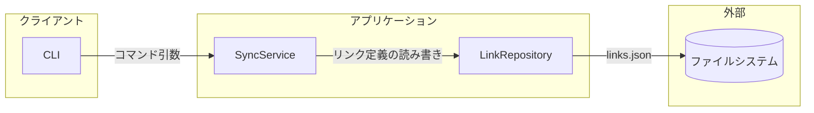
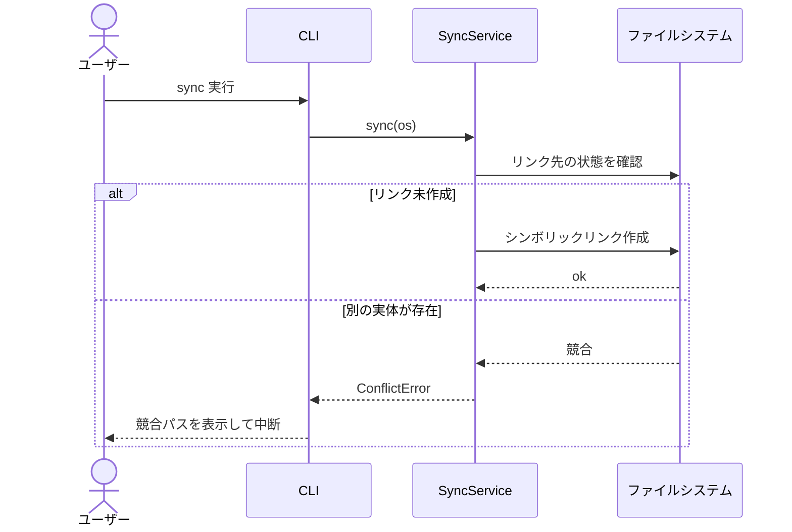
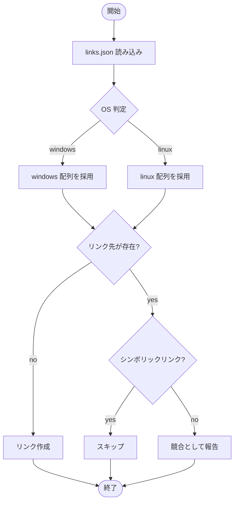
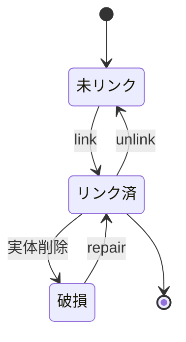
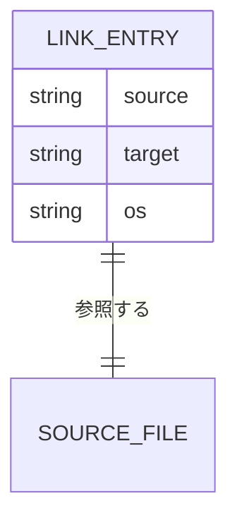

# 図の選び方と描き方

## 選び方

| 説明したいこと | 図 | Mermaid |
| --- | --- | --- |
| 構成・配置・依存の向き | 構成図 | `flowchart` + `subgraph` |
| 時系列のやりとり | シーケンス図 | `sequenceDiagram` |
| 分岐・ループ・失敗経路 | フロー図 | `flowchart TD` |
| 寿命と状態変化 | 状態遷移図 | `stateDiagram-v2` |
| データ構造と関連 | ER 図 | `erDiagram` |
| クラス・型の関係 | クラス図 | `classDiagram` |
| 画面遷移 | 遷移図 | `stateDiagram-v2` / `flowchart LR` |

迷ったら「**構造**の話か**順序**の話か」で切る。構造なら flowchart、順序なら sequenceDiagram。

## 描き方

- **ノードは15個まで。** 超えたらレイヤ（UI / アプリ / ドメイン / インフラ）か
  ユースケースで割る。
- **外部境界を囲む。** 自分の持ち物と外部サービス・OS・他チームの持ち物を `subgraph` で分ける。
  設計書で一番効くのは「どこまでが自分の責任か」。
- **矢印にラベルを付ける。** `A -->|JSON over HTTP| B`。無ラベルの矢印は情報量ゼロ。
- **失敗経路を1本は描く。** 正常系だけのシーケンス図はレビューで必ず指摘される。
  `alt` / `opt` でエラー分岐を入れる。
- **名前を本文と揃える。** 図の `UserRepo` を本文で「ユーザーリポジトリ層」と書くと別物に見える。

## よく使う型

### 構成図

### シーケンス図（失敗経路つき）

### フロー図

### 状態遷移図

### ER 図

## 落とし穴

- ラベル内の `(` `)` `:` `,` `#` は引用符で囲む（`A["fetch(url)"]`）。全角括弧は安全。
- `participant` は先に宣言する。しないと登場順に並ぶ。
- `subgraph` / `alt` の `end` 閉じ忘れ。Mermaid のエラー行番号は当てにならないので、
  書きながら閉じる。
- ノード ID は英数字。日本語は表示ラベルだけ（`SVC[同期サービス]`）。
- 矢印は依存の向き（呼ぶ側→呼ばれる側）。データの流れと逆になる箇所はラベルで明示する。
