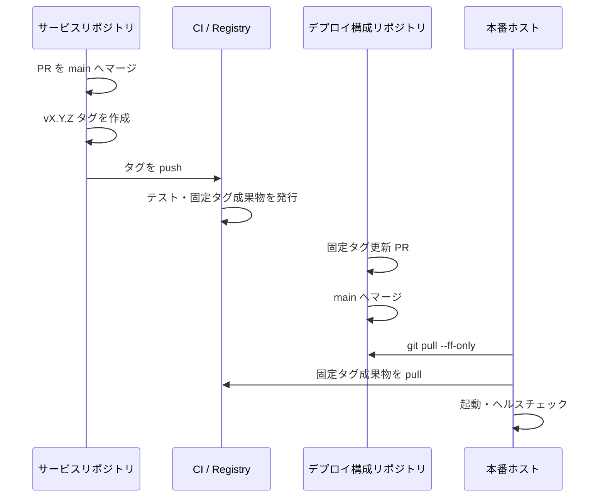
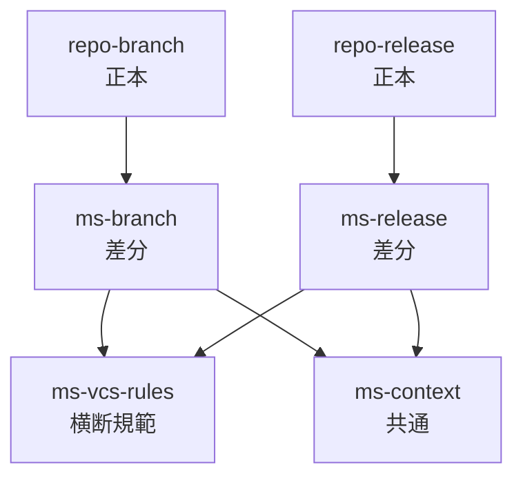

# マイクロサービス リリース戦略 設計案

サービスリポジトリの `main` マージ済みコードを、**タグ発行・成果物リリース・
デプロイ構成への採用・本番反映**まで安全に進めるための運用モデルを定義する。

**本書は [単体リポジトリ リリース戦略](solo-repo-release-strategy.md) を正本とし、
それを複数リポジトリ協調のために拡張する差分文書である。**
SemVer の基本判定、タグ規約（annotated tag、付け替え禁止）、CHANGELOG、
`implementation` の更新契機、ロールバックとホットフィックスの原則は
正本で定義済みであり、本書では再定義しない。本書が扱うのは次の 3 点に限る。

1. 成果物リリースと本番リリースの分離（デプロイ構成リポジトリの介在）。
2. サービス間契約が絡む SemVer 判定と、複数サービス同時更新の順序。
3. 固定タグによるロールバックと、組み合わせ単位の巻き戻し。

正本と矛盾する記述が生じた場合は、正本側を優先し本書を修正する。

`main` へマージするまで（ブランチ運用、設計ドキュメント、PR 条件）は
[マイクロサービス ブランチ戦略](microservice-branch-strategy.md) を参照する。

```yaml
status: proposed
implementation: planned
last_reviewed: 2026-08-17
extends: ./solo-repo-release-strategy.md
supersedes: ./development-design-release-strategy.md
```

---

## 1. 目的

正本の目的（出荷したバージョンを後から特定できる、互換性の約束を明示する、
戻す手段を先に用意する）に加えて:

- アプリケーションの完成と、本番環境への採用を分離する。
- 固定バージョンの成果物により、ロールバックを単純にする。
- 「動いている構成」を Git から再現できる状態に保つ。

対象外（正本の対象外に加えて）:

- 複数環境への大規模な段階配信。
- Git ブランチを環境そのものとして扱う運用。
- 秘密情報や実環境固有値の Git 管理。

前提となるリポジトリモデルは
[ブランチ戦略 第2章](microservice-branch-strategy.md) を正本とする。本書では複製しない。

---

## 2. リリースの定義（拡張）

正本は「コード統合」「リリース（タグと成果物）」の 2 段階を定義する。
本書はこれを 3 段階へ拡張し、成果物の確定と本番採用を分離する。

| 段階 | 完了条件 | 責務 |
|---|---|---|
| コード統合 | サービスの `main` にマージ済み | ブランチ戦略 |
| 成果物リリース | SemVer タグから固定タグの成果物を発行済み | 本書 |
| 本番リリース | デプロイ構成へ固定タグを採用し、実機確認済み | 本書 |

「`main` に入った」「タグを付けた」「本番で動いている」を同じ意味で使わない。

デプロイ構成リポジトリの `main` が、本番で採用するバージョンの正本となる。

---

## 3. 通常リリース（拡張）

タグ発行そのものの原則（`main` のコミットに打つ、annotated tag、付け替え禁止）は
正本 3 章に従う。本書は、その後段に続くデプロイ構成の更新と本番反映を定義する。



手順:

1. サービスの `main` と CI が正常であることを確認する。
2. 変更内容から SemVer を決定する。
3. `vX.Y.Z` の annotated tag を作成する。
4. タグを push し、成果物の発行完了を確認する。
5. 発行された固定タグまたは digest を確認する。
6. デプロイ構成リポジトリで参照バージョンを更新する。
7. Compose 検証、移行、バックアップ、ロールバック方法を確認する。
8. デプロイ構成の PR を `main` へマージする。
9. 本番ホストで `git pull --ff-only`、成果物取得、再作成を行う。
10. ヘルスチェックと主要ユースケースを確認する。
11. リリース結果と問題を記録する。

デプロイ構成の更新 PR 自体も、ブランチ戦略の `chore/*` ブランチと PR 条件に従う。

### 3.1 複数サービスを同時に更新するリリース

サービス間契約が変わったリリースでは、単独サービスのタグ更新では整合しない。

- 依存関係の順に反映する。原則として**提供側を先に**上げる。
- 後方互換でない契約変更は、expand/contract で 2 リリースに分割する
  （新旧両対応を出す → 消費側を移行 → 旧を落とす）。
- 同時反映が避けられない場合は、**デプロイ構成の 1 PR で全サービスのタグを更新**し、
  1 回のマージで反映できる状態にする（部分適用状態を作らない）。
- ロールバック時も同じ組み合わせへ戻せるよう、更新前のタグ一式を PR 本文に記録する。

---

## 4. SemVer（差分）

PATCH / MINOR / MAJOR の基本判定と `0.y.z` の扱いは正本 4 章に従う。
マイクロサービスでは「外部との接点」がサービス間契約であることを明示する。

- サービスの外部との接点は、**`platform` に定義されたサービス間契約**と、
  デプロイ構成が参照する公開ポート・環境変数インターフェースである。
- **公開している契約が壊れる変更は、常に MAJOR（`0.y.z` では MINOR）として扱う。**
  サービス内部だけの変更と、契約に触れる変更を同じ基準で判定しない。
- 消費側サービスが 1 つも存在しない契約でも、`platform` に定義された時点で
  契約として扱い、内部変更に降格させない。
- 成果物を作らない文書のみの変更には、原則としてサービスタグを付けない。

---

## 5. リリースに伴う文書更新（差分）

CHANGELOG の運用と `implementation` の更新契機は正本 5 章に従う。
本書では、本番反映という段階が増えることによる追加分のみを定義する。

| 契機 | 更新内容 |
|---|---|
| 本番反映が完了した | リリース記録に採用タグ一式と確認結果を残す |
| 複数サービスを同時更新した | 更新前後のタグの組み合わせを記録する |
| 契約を変更した | `platform` の契約文書の `implementation` を更新する |

`status` / `implementation` の定義は
[単体リポジトリ ブランチ戦略 4.6](solo-repo-branch-strategy.md) を正本とする。

---

## 6. ロールバック（差分）

正本 6.1（タグを上書きしない、成果物を差し替えない、`git revert`、
expand/contract、ロールバック不能な変更の事前承認）に従った上で、
**ロールバックの実体はデプロイ構成の固定タグを直前の既知正常版へ戻すこと**とする。

- `latest` を本番構成に使わない。
- イメージの再ビルドをロールバック手順にしない。戻し先は既存の固定タグである。
- 破壊的 DB 移行前にはバックアップと復元手順を確認する。
- 複数サービスを同時更新した場合は、**組み合わせ単位で**戻す。1 サービスだけ戻して
  契約が食い違う状態を作らない。

---

## 7. ホットフィックス（差分）

正本 6.2 の手順（`hotfix/<topic>` 作成 → 最小修正 → 安全確認 → PR →
PATCH タグ）に、次の後段を追加する。

6. デプロイ構成の固定タグを更新し、`main` へマージする。
7. 本番反映とヘルスチェックを行う。
8. 原因と恒久対策をトラブルシューティングまたは ADR に残す。

契約に触れるホットフィックスは、緊急時でも単独サービスだけ先に上げない。
緊急性は、秘密情報検査、バックアップ判断、ロールバック準備を省略する理由にならない。

---

## 8. リリース時の検証方針（差分）

検証コマンドを本書に重複記載しない方針は正本 8 章に従う。
デプロイ構成と本番ホストが加わるため、検証対象のみ本書で定義する。

| 対象 | 検証 |
|---|---|
| サービス | タグ時点の CI 成功、成果物の発行と digest |
| デプロイ構成 | Compose 展開、必須変数、固定タグ、ポート・volume 競合 |
| 本番ホスト | ヘルスチェック、主要ユースケース、ログとエラー率 |

実機確認が必要な項目は CI 成功と明確に区別し、リリースチェックリストに記録する。

---

## 9. スキル化: `ms-release`

目的: `repo-release` の判断に、デプロイ構成への採用と本番確認を上乗せする。

`repo-release` との関係:
`ms-release` は [`repo-release`](solo-repo-release-strategy.md) を前提とし、
SemVer 判定・CHANGELOG 生成・タグ発行の手順を再定義しない。
SKILL.md に「`repo-release` の規範に従うこと」を明記し、本書の差分のみを持つ。

固有の責務:

- SemVer 判定に契約変更の有無を上乗せする（4 章）。
- タグ、push、`main` マージ、デプロイの前に必要な承認を得る。
- 成果物の発行と digest を確認する。
- デプロイ構成の固定タグ更新を作成する。
- 複数サービス同時更新の順序と分割を判定する。
- バックアップ、移行、ロールバックを確認する。
- 本番反映後のヘルスチェックを実施する。
- 結果と追加すべき運用知識を記録する。

非責務:

- 既存タグを移動または上書きしない。
- `latest` を本番へ導入しない。
- 未確認の CI・成果物発行・デプロイを成功扱いしない。
- 明示的な承認なしに本番状態を変更しない。
- 作業ブランチの作成やコード変更を行わない（`ms-branch` の責務）。

構成:

```text
ms-release/
├── SKILL.md                      # repo-release を前提として宣言
└── references/
    ├── deploy-policy.md          # 第3章・第6章・第7章
    └── release-checks.md         # 第8章とチェックリスト生成
```

`repo-release/references/versioning.md` を複製しない。契約変更の判定だけを上乗せする。

### 9.1 `ms-branch` との関係 — 派生させるか

**結論: 同一スキルの派生（サブコマンド／モード分岐）にはしない。
正本スキル（`repo-branch` / `repo-release`）を土台に、
共通の規範スキル `ms-vcs-rules` を挟んだ兄弟スキルとする。**



分ける理由:

- **起動条件が違う**。`ms-branch` は作業のたびに、`ms-release` はリリースのたびに呼ばれる。
  頻度も入力も違うものを 1 スキルにすると、説明文（description）が曖昧になり誤起動する。
- **危険度が違う**。`ms-branch` はローカル変更まで、`ms-release` はタグ・本番状態を触る。
  承認の粒度を分けたい。
- **非責務が対称になっている**。互いの責務を明示的に禁止しており、
  1 スキルに統合するとこの防御が消える。

それでも共通化が必要な部分:

| 内容 | 置き場所 |
|---|---|
| ブランチ命名、作業手順、`.work/` と蒸留、`main` 保護、PR 必須項目 | `repo-branch`（正本） |
| 文書メタデータ（`status` / `implementation`）、文書種別の責務 | `repo-branch`（正本） |
| SemVer、タグ規約、CHANGELOG、ロールバック原則 | `repo-release`（正本） |
| リポジトリモデル、リポジトリ種別の判定 | `ms-context` |
| リポジトリ間の正本配置、契約変更の扱い | `ms-vcs-rules` |
| `platform` 先行判定、横断 PR の相互リンク | `ms-branch` |
| 固定タグ、デプロイ構成更新、本番反映 | `ms-release` |

同一ルールを複数ファイルへコピーしない。正本レイヤーと規範レイヤーの内容を
手順スキルへ複製せず、SKILL.md に「作業前に `repo-*` と `ms-vcs-rules` を
読み込むこと」と明記する
（[スキル群設計案 第2章](microservice-skills-design.md) と同じ方式）。

段階的に作る場合は、まず `repo-branch` / `repo-release` を作り、
マイクロサービス案件が実際に発生してから `ms-*` を差分として積む。
`ms-vcs-rules` はさらに後出しでよい。

### 9.2 スクリプト化の範囲

最初は指示中心のスキルとし、運用が安定してから次のような決定的処理だけをスクリプト化する。

- リポジトリ状態の収集。
- 固定イメージタグの検査（`latest` 混入検出）。
- リリース前チェック結果の Markdown 生成。

マージ、タグ、push、本番デプロイは、単一の無条件スクリプトにまとめない。

---

## 10. 導入順序

| 段階 | 内容 | 完了条件 |
|---|---|---|
| 0 | 正本（単体リポジトリ リリース戦略）の適用 | サービス単体でタグ運用が回る |
| 1 | 本書の合意 | `status: accepted` へ変更 |
| 2 | リリースチェックリスト | 手動運用で 1 回通す |
| 3 | 固定タグの徹底 | 本番構成から `latest` を排除 |
| 4 | `ms-release` | PATCH リリースで試行 |
| 5 | リリース記録・監査 | タグ、採用バージョン、確認結果を追跡可能にする |

いきなり自動デプロイまで進めず、検証と固定タグによる再現性を先に整える。

---

## 11. 運用指標

- タグ発行から本番採用までの時間。
- ロールバックに要した時間と回数。
- 本番反映後に発覚した不具合の件数。
- 契約変更を伴うリリースで、部分適用状態が発生した回数。
- 検証省略など例外運用の回数。

---

## 12. 未決事項

正本側の未決事項（CHANGELOG の生成方法、リリース記録の置き場所の一般論、
プレリリース、スキル統合）は本書で重複して扱わない。本書固有の未決事項は次のとおり。

- サービスの `main` マージごとにタグを発行するか、複数変更をまとめて発行するか。
- 本番反映を完全手動にするか、承認付き自動デプロイへ移行するか。
- デプロイ成功後に `deploy-YYYYMMDD-HHMM` のような記録タグを付けるか。
- リリース記録をどこに置くか（デプロイ構成リポジトリか、システム設計・運用リポジトリか）。
- `ms-vcs-rules` を最初から切り出すか、重複が出てから切り出すか。

初期推奨:

- サービスの `main` マージとタグ発行は分離する。
- 本番反映は手動とし、チェックリストを先に定着させる。
- リリース記録はデプロイ構成リポジトリに置く（採用バージョンの正本と同じ場所）。
- `ms-vcs-rules` は後出しにし、まず 2 スキルで運用する。
