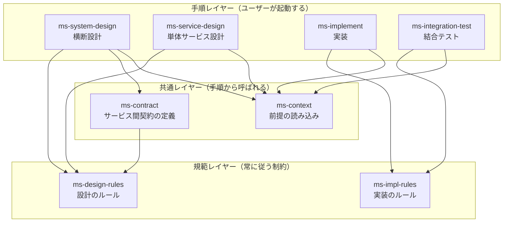

# マイクロサービス開発用スキル群 設計案

複数のマイクロサービスを Docker コンテナとして立ち上げるシステムを、
統括リポジトリ + 個別サービスリポジトリの構成で開発するための Claude スキル群の設計。

配置先は `claude/skills/` 配下。`links.json` は `claude/skills` ディレクトリごと
`~/.claude/skills` にリンクしているため、**スキルを追加しても links.json の変更は不要**。

---

## 1. 前提となるリポジトリ構成

```
workspace/                  # 任意の親ディレクトリ（git管理外でよい）
├── platform/               # ← 旧「統括リポジトリ」。システム全体の仕様を持つ
├── service-auth/           # 各サービスは個別リポジトリ
├── service-billing/
└── service-notification/
```

同階層に並べる。`platform/` から各サービスの実装を読むことはあるが、
**サービス同士がファイルパスで参照し合うことはしない**（後述の実装ルール）。

### 1.1 「統括リポジトリ」の改名案

迷っている点への回答。役割は「システム全体の意図・サービス間契約・横断ユースケースを
永続化する唯一の情報源」であり、CI やデプロイの束ね役ではない。この役割を最も素直に
表すのは `platform`。

| 候補 | 印象・意味 | 評価 |
|---|---|---|
| **`platform`** | システム全体の土台。業界で最も通じる | **推奨**。汎用的で、後からCI/IaCを載せても名前が破綻しない |
| `system` | 全体そのもの | 一般語すぎて検索・会話で埋もれる |
| `contracts` | サービス間契約 | 契約以外（ユースケース、ADR）を置きにくくなる |
| `atlas` / `compass` | システムの地図 | 意味は良いが、初見の人に説明が要る |
| `meta` / `root` / `hub` | 束ねるもの | 「中身が何か」を全く語らない |

以降このドキュメントでは **`platform` リポジトリ**（または「プラットフォームリポジトリ」）
と呼ぶ。スキル内の記述もこの語に統一する。

> 注: `platform` は「基盤チームが持つ共通基盤コード」の意味で使われることもある。
> それと混同する懸念があるなら次点は `system-spec`（仕様であることが明示される）。

---

## 2. スキル全体像

ユーザーの見立て通り**規範レイヤー**と**手順レイヤー**の2層に分ける。加えて、
両方から参照される**共通レイヤー**（コンテキスト読み込み・契約の書き方）を挟む。



| スキル | レイヤー | 起動のされ方 |
|---|---|---|
| `ms-design-rules` | 規範 | 設計系スキルから必ず読み込まれる。ユーザーが直接「設計書をレビューして」と呼ぶこともある |
| `ms-impl-rules` | 規範 | 実装系スキルから必ず読み込まれる。コードレビュー用途でも直接呼べる |
| `ms-context` | 共通 | 設計・実装のどのスキルからも最初に呼ばれる |
| `ms-contract` | 共通 | 横断設計の中で、I/Fを決める段になったら呼ばれる |
| `ms-system-design` | 手順 | ユーザーが `platform` で起動 |
| `ms-service-design` | 手順 | ユーザーが各サービスリポジトリで起動 |
| `ms-implement` | 手順 | ユーザーが各サービスリポジトリで起動 |
| `ms-integration-test` | 手順 | ユーザーが `platform` で起動 |

**スキル間の呼び出し方**: 上位スキルの SKILL.md に
「作業を始める前に、Skill ツールで `ms-design-rules` を読み込むこと」と明記する。
規範レイヤーの内容を各スキルにコピーしない（同期が崩れるため）。

**命名接頭辞**: グローバル（`~/.claude/skills`）に置かれ他プロジェクトのスキルと混ざるため
`ms-` を付ける。

---

## 3. 各スキルの仕様

### 3.1 `ms-design-rules` — 設計のルール（規範）

設計書に**書いてよいこと・書いてはいけないこと**を明文化する。手順は持たない。

```
ms-design-rules/
├── SKILL.md                    # 原則（10個程度）と、違反例→修正例
└── references/
    ├── forbidden.md            # してはいけないこと（詳細と理由）
    ├── document-types.md       # 文書種別ごとの粒度と責務境界
    └── review-checklist.md     # 既存設計書をレビューするときの観点
```

主な禁止事項（`references/forbidden.md`）:

- **実環境の値を書かない** — ホスト名、IP、ポート番号、URL、DB名、アカウント名、
  認証情報、絶対パス。必要なら**環境変数名だけ**を書く（`DB_HOST` に接続先を与える、等）。
- **ディレクトリ構成・ファイル名・クラス名を書かない** — 設計書は「何を・なぜ」を扱う。
  「どう配置するか」は実装の自由度であり、書いた瞬間に実装と乖離して腐る。
- **具体的なライブラリ／バージョンを要件・設計文書に書かない** — 技術選定は ADR に隔離する。
- **他サービスの内部を書かない** — `platform` に書けるのは公開 I/F と振る舞いの約束だけ。
  サービス内部の設計は各サービスリポジトリに閉じる。
- **他サービスの DB を直接読む設計をしない**。
- **「現在の実装がこうだから」を仕様として書かない** — 実装の追認は設計ではない。
  現状を記録したいなら「現状」と明示した別セクションに書く。
- **未確定を断定で書かない** — TBD として残す。埋める作業は `resolve-open-questions` スキルに任せる。
- **図は Mermaid で書く** — バイナリ画像は差分が読めず、レビューできない。

### 3.2 `ms-impl-rules` — 実装のルール（規範）

```
ms-impl-rules/
├── SKILL.md
└── references/
    ├── configuration.md        # 設定・環境変数・シークレット
    ├── service-boundary.md     # サービス境界を越えるときの決まり
    ├── container.md            # Dockerfile / compose の規約
    └── observability.md        # ログ・ヘルスチェック・相関ID
```

主なルール:

- **設定は環境変数からのみ読む**。コードにデフォルト値を書く場合も、
  本番相当の値は書かない（`localhost` 等の開発用フォールバックに限る）。
- **`.env` はコミットしない。`.env.example` にキーだけを列挙する**。
  シークレットをイメージにも compose ファイルにも焼き込まない。
- **他サービスのリポジトリを相対パスで参照しない**。同階層に並んでいても、
  `../service-auth/...` を import した時点で独立デプロイ可能性が壊れる。
  共有したいものは (a) 契約からのコード生成、(b) 独立した共有ライブラリ、のどちらかにする。
- **他サービスのデータベースに直接接続しない**。公開 I/F 経由のみ。
- **契約の変更は `platform` を先に変更する**（spec-first）。実装から契約を追認しない。
- **接続先はサービス名 + 環境変数**で解決する。IP・ポート直書き禁止。
- Dockerfile はマルチステージ、非 root 実行、ベースイメージのタグ固定（`latest` 禁止）。
- ヘルスチェックエンドポイント、graceful shutdown、構造化ログ、相関ID の伝播を必須とする。

### 3.3 `ms-context` — プロジェクト前提の読み込み（共通）

「設計・実装のたびに `platform` の何をどの順で読むか」を固定する。これが無いと、
毎回読む範囲がぶれて、同じ質問に違う答えが返る。

```
ms-context/
├── SKILL.md                    # 読み込み手順と、読んだ結果の要約フォーマット
└── references/
    ├── platform-layout.md      # platform リポジトリの標準構成（下の第4章）
    └── discovery.md            # platform が見つからない/構成が違うときの対処
```

手順の骨子:

1. カレントリポジトリの種別を判定する（`platform` か、サービスか）。
2. `platform` を探す（同階層 → 親 → ユーザーに確認）。見つからなければ**推測で進めず確認する**。
3. 読む順序を固定する: `system/overview` → `services/*`（対象サービスとその依存先のみ）→
   関係する `contracts/*` → 関係する `flows/*` → `decisions/*`。
   **全部読まない**。対象サービスと直接の依存先に絞る。
4. 読み取った前提を短く要約して提示し、「この理解で進めてよいか」を確認してから作業に入る。
5. 前提と矛盾する依頼だった場合は、実装を始める前に矛盾点を指摘する。

### 3.4 `ms-contract` — サービス間契約の定義（共通）

サービスをまたぐ機能の設計で、最も間違えると高くつく部分だけを切り出したスキル。

```
ms-contract/
├── SKILL.md
└── references/
    ├── sync-api.md             # 同期API（リクエスト/レスポンス、エラー、冪等性）
    ├── async-event.md          # 非同期イベント（イベント名、ペイロード、順序、重複）
    ├── versioning.md           # 後方互換の壊し方／段階的移行手順
    └── template.md             # 契約ドキュメントのテンプレート
```

決めさせる項目: 同期か非同期か / 誰が所有者か / 失敗時の振る舞い（リトライ・タイムアウト・
冪等性キー）/ 互換性の壊し方 / 誰が消費しているか。

### 3.5 `ms-system-design` — サービス横断設計（手順）

`platform` で「複数サービスにまたがる機能」を設計するときのスキル。

```
ms-system-design/
├── SKILL.md
└── references/
    ├── new-feature.md          # 横断機能を設計する手順
    ├── new-service.md          # サービスを新設する／責務を分割する手順
    ├── service-catalog.md      # サービスカタログの書き方（種別・所有データ・公開I/F）
    └── adr.md                  # 決定を ADR に残す書式
```

横断機能の設計手順（`new-feature.md`）:

1. `ms-context` で前提を読む。
2. 機能を**ユースケース単位**で `flows/` に1ファイル書く（Mermaid のシーケンス図込み）。
3. その機能に関わるサービスを列挙し、**各サービスの責務の増分**を書き出す。
4. サービス間をまたぐ箇所を `ms-contract` で契約に落とす。
5. 各サービスリポジトリへの**作業の分解**を書く（何を実装するかまで。どう実装するかは書かない）。
6. トレードオフのある判断をしたら ADR に残す。

出力は `platform` にコミットされ、以降 `ms-context` が読む対象になる。

### 3.6 `ms-service-design` — 単体サービス設計（手順）

各サービスリポジトリで、そのサービス内部を設計するときのスキル。

```
ms-service-design/
├── SKILL.md
└── references/
    ├── service-doc.md          # サービス内設計書の構成
    ├── data-model.md           # 所有データの設計（他サービスのデータを持たない原則）
    └── dependency.md           # 依存の扱い（下の第5章の分類に対応）
```

`platform` 側の契約を**入力**として扱い、契約に反する内部設計をしない。
逆に、内部設計の都合で契約を変えたくなったら、**先に `platform` を変更する**手順に戻す。

### 3.7 `ms-implement` — 実装（手順）

```
ms-implement/
├── SKILL.md
└── references/
    ├── from-design.md          # 設計書からコードに落とす手順
    ├── config-wiring.md        # 環境変数の追加手順（.env.example / compose / 設計書の3点更新）
    └── external-service.md     # セルフホストサービスをアダプタで包む手順
```

### 3.8 `ms-integration-test` — 結合テスト（手順）

```
ms-integration-test/
├── SKILL.md
└── references/
    ├── levels.md               # テストの層（単体 / 契約 / 結合 / シナリオ）の切り分け
    ├── compose-profile.md      # 必要なサービスだけ起動する compose 構成
    └── fixtures.md             # テストデータと、外部サービスの初期化
```

---

## 4. `platform` リポジトリの標準構成

`ms-context` と `ms-system-design` が前提とする構成。

```
platform/
├── docs/
│   ├── system/
│   │   ├── overview.md         # システムの目的・境界・利用者・非機能要件
│   │   └── glossary.md         # ユビキタス言語
│   ├── services/               # 1サービス1ファイル（サービスカタログ）
│   │   └── auth.md             # 責務 / 種別 / 所有データ / 公開I/F / 依存先
│   ├── contracts/              # サービス間契約
│   │   ├── api/
│   │   └── events/
│   ├── flows/                  # サービス横断ユースケース
│   ├── decisions/              # ADR（0001-....md）
│   └── ops/
│       └── env-catalog.md      # 環境変数の一覧（キー名と意味のみ。値は書かない）
└── compose/                    # ローカル・結合テスト用の compose とプロファイル
    └── .env.example
```

> この構成規約自体は「スキルの約束事」であり、第3.1節の「設計書にディレクトリ構成を書かない」
> ルールとは別レイヤー。禁止しているのは**個々の設計書の中に実装の配置を書き込むこと**であって、
> リポジトリの標準レイアウトを規約として定めることではない。

---

## 5. サービスの分類と扱い

迷っている点への回答。サービスカタログの `種別` フィールドで区別し、
スキルの分岐条件にする。

| 種別 | 定義 | 設計 | 実装 | テスト |
|---|---|---|---|---|
| **autonomous** | 単体で起動でき、他サービスに依存しない | `ms-service-design` | 自リポジトリ | 単体テストで完結 |
| **dependent** | 他サービスの公開I/Fに依存する | `ms-service-design` + 依存先の契約を入力にする | 自リポジトリ | 依存先はコントラクトテストで固定し、単体テストではスタブ |
| **external** | ghcr 等で公開済みのセルフホストサービス（DB、キュー、認証基盤など） | **設計しない**。`services/` には「利用契約」のみ書く（何のために使うか、どのI/Fに依存するか、代替可能性） | **直接依存せずアダプタ層で包む**。ベンダー固有の型をドメイン層に持ち込まない | 結合テストでは**モックせず本物のイメージを起動**する |

`external` を最初からアダプタで包むのは、「セルフホストサービスは
後から乗り換える／自前実装に置き換える」ことが実際に起きるため。
包んでいれば差し替えはアダプタ1つで済む。

---

## 6. サービスをまたがる機能の扱い

- **設計は `platform` に集約する。実装は各サービスリポジトリに散らす。**
  1つの横断機能 = `flows/` の1ファイル + 関係する `contracts/` + 各サービスへの作業分解。
- 横断機能の設計書には**サービスごとの作業リスト**を必ず含める。
  これが各サービスで `ms-service-design` / `ms-implement` を起動するときの入口になる。
- **共有コードをコピーしない**。共有が必要なら、契約からのコード生成か、
  独立したライブラリリポジトリ（バージョン付きで配布）にする。
- 実装の進捗管理は `platform` の設計書には書かない（設計書は「正」であって進行表ではない）。

### 結合テストの層

| 層 | 場所 | 対象 |
|---|---|---|
| 単体 | 各サービスリポジトリ | サービス内部のロジック。外部はすべてスタブ |
| 契約 | 各サービスリポジトリ | 自分が提供する／消費する契約への適合。相手を起動しない |
| 結合 | 各サービスリポジトリ | 自サービス + それが依存する `external`（実イメージ） |
| シナリオ | `platform` | `flows/` のユースケース単位。compose プロファイルで必要なサービスだけ起動 |

シナリオテストを `platform` に置くのは、**横断機能の設計書と1対1で対応させる**ため。
設計書を書いたら対応するシナリオテストが要る、という関係を機械的に保てる。

---

## 7. 導入の順序

1つずつ作って使いながら育てる。最初から8個作らない。

| 段階 | 作るもの | 理由 |
|---|---|---|
| 第1段階 | `ms-design-rules`, `ms-impl-rules` | 規範だけでも単体で価値がある（レビューに使える）。他スキルの土台 |
| 第2段階 | `ms-context` | 手順スキル全部が依存するため、次に必要 |
| 第3段階 | `ms-system-design`, `ms-contract` | `platform` の構成を実際に作りながら固める |
| 第4段階 | `ms-service-design`, `ms-implement` | サービス側の運用が始まってから |
| 第5段階 | `ms-integration-test` | サービスが2つ以上動いてから |

---

## 8. 未確定事項

- `platform` という名前で確定してよいか（次点: `system-spec`）。
- サービスカタログを Markdown で持つか、機械可読な YAML（+ 生成した Markdown）で持つか。
  スキルが読むだけなら Markdown で足りるが、compose やCIから使うなら YAML。
- `ms-implement` を言語非依存のまま作るか、言語ごと（例: `ms-implement-python`）に分けるか。
  採用言語が1〜2種に収まるなら非依存のままでよい。
- ADR を `platform` だけに置くか、各サービスリポジトリにも置くか
  （サービス内部の技術選定は各リポジトリに置くのが自然か）。
- 契約の記述形式（OpenAPI / AsyncAPI / Protobuf を使うか、Markdown で書くか）。
